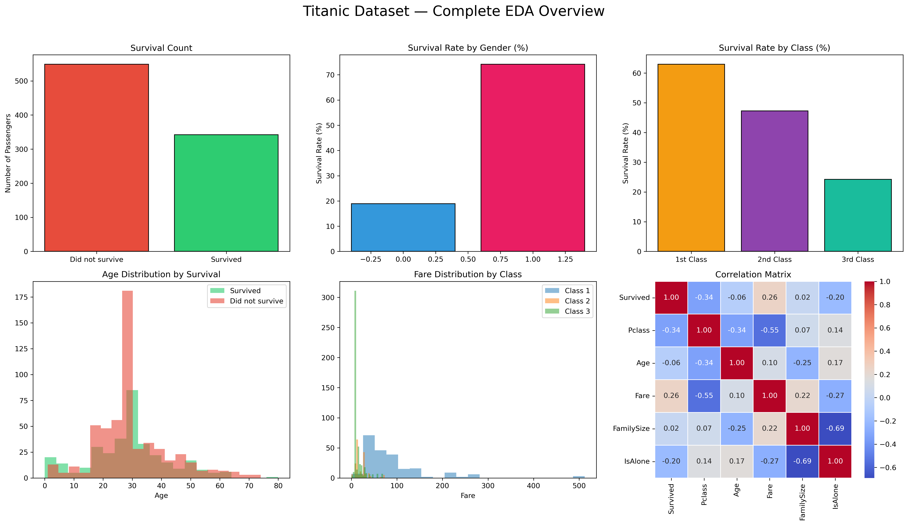

# Titanic EDA & Preprocessing

Exploratory data analysis and ML preprocessing on the Titanic dataset using Pandas.

## What's covered
- Data exploration and summary statistics
- Handling missing values (Age, Embarked, Cabin)
- Feature engineering: FamilySize, IsAlone, AgeGroup, Title, FarePerPerson
- Encoding categorical variables
- Filtering and groupby analysis

## Tools
Python, Pandas, NumPy, Jupyter Notebook

## Dataset
[Titanic Dataset](https://www.kaggle.com/datasets/yasserh/titanic-dataset)# titanic-eda-preprocessing

## View Notebook
[Open in nbviewer](https://nbviewer.org/github/Areeeshaa/titanic-eda-preprocessing/blob/main/titanic_eda_preprocessing.ipynb)
## Preview

